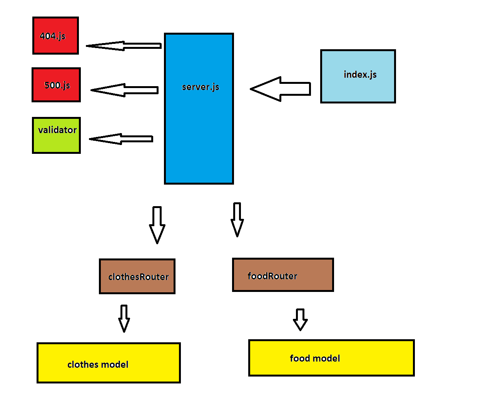

# basic-api-server

## Deployment
Author: Mohammad Mahmoud Altamimi
 
 

## URLs :

## Heroku applications :

[server-deploy-main](https://basic-server-api.herokuapp.com/)
 
 

## Github actions:
[actions](https://github.com/MohammadAltamimi98/basic-api-server/actions)

 
 

## pull request:
[PR](https://github.com/MohammadAltamimi98/basic-api-server/pull/1)
 
 

## Drawings:
UML

## Setup
Installed dependencies
> npm i dotenv npm i express npm i -D jest supertest

 
 

## .env requirments
> PORT - port number

 
 

## Running the application
> npm start
> Endpoint: /api/v1/food 
> Endpoint: /api/v1/clothes

 
 

## Tests
> Unit Tests: npm run test
